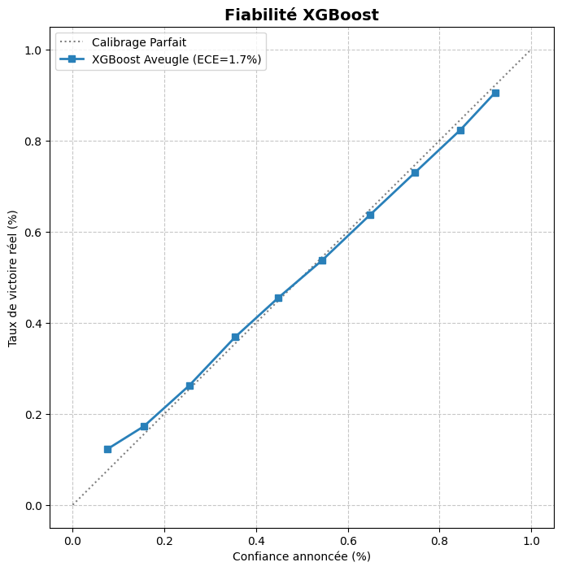
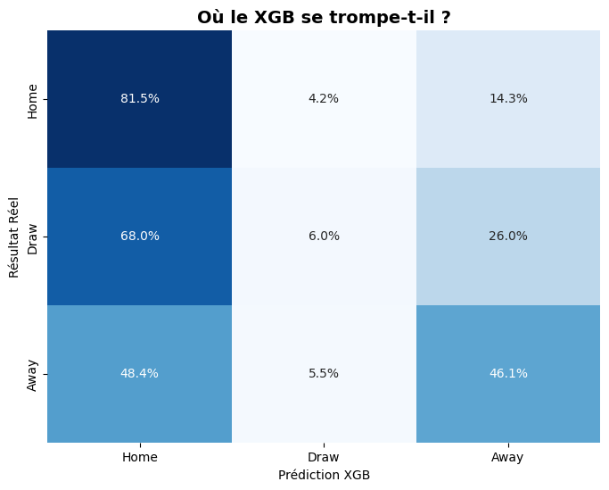
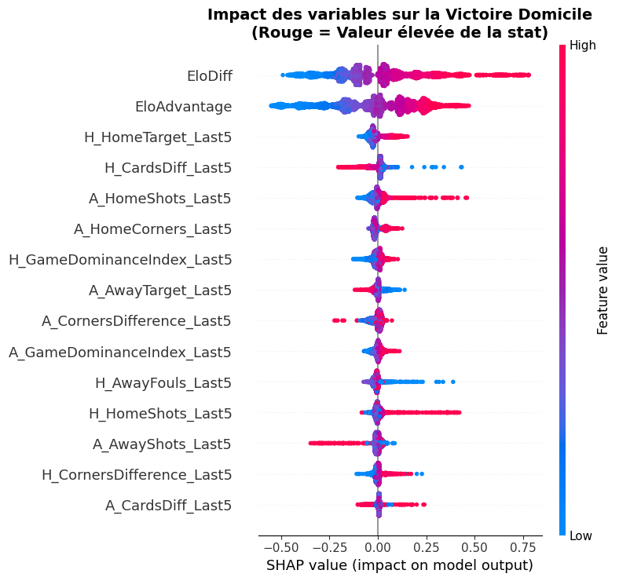
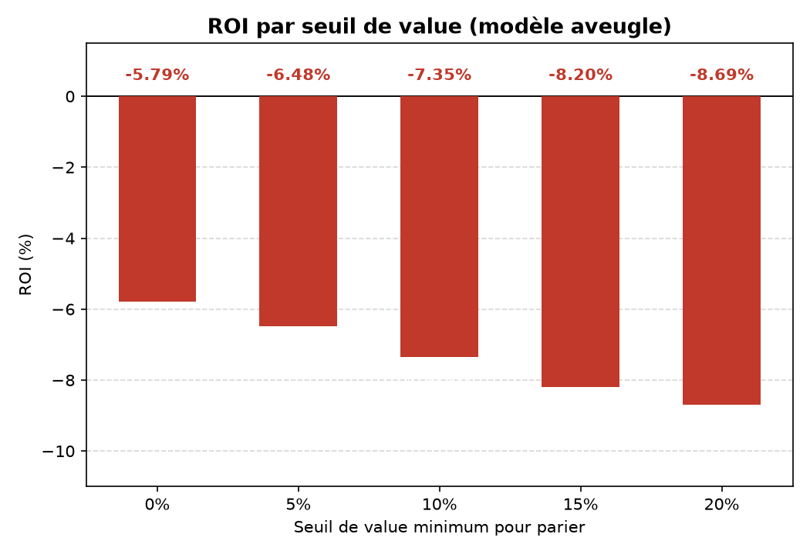

# ⚽ Football Match Prediction — Étude d'efficience de marché

[](https://github.com/AlbanHtn/football-match-prediction/actions/workflows/ci.yml)
[](https://www.python.org/downloads/)
[](LICENSE)
[](#running-tests)

**Les données sportives pré-match (classement Elo, forme récente, statistiques de match) permettent-elles de prédire les résultats de football aussi bien que les cotes des bookmakers — sans utiliser ces cotes ?**

Pipeline end-to-end sur **52 580 matchs des 5 grands championnats européens (2006–2025)** : réconciliation des données, feature engineering temporel, et protocole d'évaluation strict anti-fuite (`TimeSeriesSplit`, 5 folds) comparant Régression Logistique, Random Forest et XGBoost à la baseline du marché.

> **Résultat clé :** le modèle XGBoost aveugle (sans les cotes) atteint **51,9% d'accuracy**, captant **96,7% du signal prédictif du marché** (baseline à 53,63%) avec une calibration fine (**ECE = 1,7%**). Une simulation de value-betting sur ses prédictions donne un **ROI = −5,8%** — quasiment aligné sur la marge du bookmaker. Ce n'est pas une stratégie ratée ; c'est une preuve empirique de l'**hypothèse d'efficience de marché** sur les marchés de paris football, obtenue honnêtement plutôt que par surapprentissage ou fuite de données.

---

## Résultats clés

| Modèle | Accuracy — avec cotes | Accuracy — aveugle (sans cotes) |
|-------|----------------------|------------------------------|
| Baseline marché *(parier sur le favori)* | — | **53,63%** |
| Régression Logistique | 53,39% | 52,45% |
| Random Forest | 53,41% | 52,47% |
| **XGBoost** | 52,54% | **51,86%** |

*Moyenne sur 5 folds chronologiques `TimeSeriesSplit` couvrant 2013–2025. Les modèles "aveugles" utilisent uniquement des variables sportives (Elo, forme, statistiques de match) — aucune cote de bookmaker.*

**Diagnostics — XGBoost aveugle :**

| Métrique | Valeur | Interprétation |
|--------|-------|-----------------|
| Accuracy | 51,86% | 96,7% de l'accuracy de la baseline marché (51,86 / 53,63) |
| Log Loss | 0,993 | — |
| Brier Score (Domicile) | 0,218 | — |
| Expected Calibration Error (ECE) | 1,7% | Les probabilités prédites correspondent finement aux fréquences observées |
| ROI à seuil de value 0% | **−5,79%** | Aligné sur la marge bookmaker (~5–6%) → pas d'edge exploitable |

**Pourquoi un ROI négatif est le bon résultat, pas un échec :** un modèle qui "bat" durablement le marché sur un jeu de données public couvrant une décennie, sans biais de prescience, serait extraordinaire — et suspect. Les cotes fixées par des bookmakers professionnels intègrent déjà quasiment toute l'information publique disponible. Reproduire 96,7% de ce signal à partir de variables purement sportives (sans information de marché) est un résultat solide ; perdre de l'argent à un rythme qui reflète précisément la marge du bookmaker, plutôt qu'une anomalie inexpliquée, est le résultat honnête et attendu d'un marché sans inefficience évidente. Il est présenté ici comme une validation de méthodologie, pas comme une stratégie de trading.

---

## Visualisations

<table>
<tr>
<td width="50%">

**Calibration (ECE = 1,7%)**


</td>
<td width="50%">

**Matrice de confusion (aveugle)**


</td>
</tr>
<tr>
<td width="50%">

**Explicabilité SHAP (top variables)**


</td>
<td width="50%">

**ROI par seuil de value**


</td>
</tr>
</table>

*Le modèle est bien calibré (les probabilités annoncées reflètent les fréquences observées), confond surtout les nuls avec le favori (comportement attendu — les nuls sont structurellement difficiles à prédire), s'appuie principalement sur l'écart de classement Elo, et son ROI se dégrade quand on sélectionne des paris plus "exotiques" (value élevée) — cohérent avec un marché efficient.*

---

## Contexte métier

Les marchés de paris agrègent des flux d'information considérables — actualité des équipes, sentiment du public, positionnement des parieurs avertis — en un seul chiffre : la cote. Tester si un modèle piloté par la donnée peut approcher ou battre ce chiffre est un test direct d'efficience de marché, et un contrôle de cohérence standard que toute équipe quantitative de paris sportifs doit faire passer à ses modèles *avant* de leur confier du capital.

**Pourquoi ce test est difficile et honnête :**
- Le football est un sport à faible score et forte variance — une seule phase arrêtée change le résultat
- Les matchs nuls sont structurellement difficiles à prédire (~26% des matchs, faible corrélation avec le signal pré-match — voir le recall par classe ci-dessous)
- Les cotes des bookmakers encodent déjà quasiment toute l'information publique ; les battre durablement impliquerait soit du surapprentissage, soit une fuite de données, soit un edge réel (rare)
- Toute variable de forme récente ou de classement Elo calculée sans précaution introduit un biais d'anticipation (look-ahead bias) et produit une accuracy artificiellement gonflée — l'inverse de ce qui a été obtenu ici

---

## Méthodologie

### Protocole anti-fuite — Trois mécanismes indépendants

1. **Classement Elo** — fusionné via `pd.merge_asof(direction='backward')` : seuls les snapshots Elo datés *avant* chaque match sont éligibles.
2. **Forme récente / statistiques de match** — toutes les fenêtres glissantes (`k=5`) utilisent `.shift(1)` : le résultat du match courant ne fuite jamais dans ses propres variables.
3. **Validation croisée** — `TimeSeriesSplit(n_splits=5)` : les folds d'entraînement précèdent toujours chronologiquement leur fold de validation. Pas de mélange, pas de k-fold aléatoire.

### Deux variantes de modèle par algorithme

- **V1 — avec cotes** : inclut les probabilités implicites des bookmakers comme variables. Utilisé comme benchmark de borne supérieure — suit le marché de très près par construction.
- **V2 — aveugle** : variables purement sportives (Elo, forme, statistiques de match). C'est le modèle dont les résultats sont rapportés ci-dessus — il répond à la vraie question : *les données sportives publiques seules portent-elles un signal prédictif ?*

### Réconciliation des données

Les noms de clubs entre la source des résultats de matchs et la source des classements Elo ne correspondent pas exactement (accents, abréviations, traductions). Une passe de **fuzzy matching** (`rapidfuzz`) contre une table de correspondance curée (`club_mapping_clean.csv`) a porté la complétude des variables Elo de **59,5% à 90,6%** sur le sous-ensemble Big 5.

---

## Architecture

```
src/football_prediction/          # Package Python installable (src layout, PEP 517)
│
├── config/
│   └── settings.py               # Dataclasses DataPaths + ModelConfig — aucun chemin en dur
│
├── data/
│   ├── ingestion.py               # Chargement CSV avec validation de schéma & parsing typé
│   ├── cleaning.py                # Filtre Big5, filtre année, filtre de complétude
│   └── merging.py                 # Jointure Elo via merge_asof(direction='backward')
│
├── features/
│   ├── elo_features.py            # EloDiff, EloTotal, HomeEloAdvantage
│   ├── form_features.py           # Taux de victoire glissants (fenêtres 3 & 5 matchs) + momentum
│   └── odds_features.py           # Probabilités implicites, marge bookmaker
│
├── models/
│   ├── base.py                    # BaseMatchPredictor abstrait — fit / predict / save / load
│   ├── logistic_regression.py     # LR multinomiale dans un Pipeline StandardScaler
│   ├── random_forest.py           # RandomForest (n=200, max_depth=8, min_leaf=20)
│   └── xgboost_model.py           # XGBoost avec mapping labels H/D/A ↔ 0/1/2
│
├── evaluation/
│   ├── metrics.py                 # Accuracy, F1-macro, log loss, simulation ROI
│   └── baseline.py                # Baseline marché : argmax(probabilités implicites)
│
└── pipeline.py                    # Point d'entrée CLI : chargement → nettoyage → features → entraînement → évaluation
```

---

## Pipeline de données

```
  Matches.csv                 EloRatings.csv
  228 377 lignes               242 591 snapshots
  Football-Data.co.uk         ClubElo.com
        │                           │
        └─────────────┬─────────────┘
                       │
    Réconciliation des clubs par fuzzy matching (rapidfuzz)
    merge_asof(direction='backward') — pas d'anticipation
    Complétude des variables Elo : 59,5% → 90,6%
                       │
        ┌──────────────▼──────────────┐
        │      Feature Engineering    │
        │  · EloDiff / EloTotal       │
        │  · Forme glissante, k=5 (lag-1)│  ← lag-1 : match courant exclu
        │  · Probabilités implicites   │  ← variables issues des cotes (V1 uniquement)
        └──────────────┬──────────────┘
                       │
        Filtre : Big 5 championnats, 2006–2025
        → 52 580 matchs
                       │
        TimeSeriesSplit (5 folds, chronologique)
                       │
        ┌──────────────▼──────────────┐
        │   Classification 3 classes  │
        │   H (Domicile) / D / A (Ext.)│
        │  V1 (avec cotes) vs V2 (aveugle)│
        └──────────────────────────────┘
```

---

## Jeu de données

| Source | Fichier | Taille | Contenu |
|--------|------|------|---------|
| [Football-Data.co.uk](https://www.football-data.co.uk) | `Matches.csv` | 228 377 lignes | Résultats & statistiques de matchs, plusieurs championnats européens |
| [ClubElo.com](http://clubelo.com) | `EloRatings.csv` | 242 591 snapshots | Classement Elo bimensuel par club |

**Jeu de données de modélisation** (après filtre Big-5, post-2006, filtrage qualité) : **52 580 matchs** — Premier League · Ligue 1 · Bundesliga · Serie A · La Liga.

Les fichiers de données ne sont pas versionnés (trop volumineux pour git). Voir [Installation](#installation) pour la mise en place.

---

## Stack technique

| Catégorie | Outils |
|----------|-------|
| **ML Core** | scikit-learn, XGBoost, SHAP |
| **Données** | pandas, numpy, scipy, rapidfuzz |
| **Packaging** | pyproject.toml (PEP 517), src layout, setuptools |
| **Qualité** | pytest (49 tests), ruff, mypy, CI GitHub Actions |
| **Profiling** | ydata-profiling |
| **Sérialisation** | joblib |

---

## Structure du repository

```
.
├── src/football_prediction/    # Package Python principal (voir Architecture)
├── tests/                      # 49 tests unitaires
│   ├── test_data/               # Ingestion, nettoyage, fusion
│   ├── test_features/           # Variables Elo, variables cotes
│   └── test_models/             # Aller-retour modèle + métriques d'évaluation
├── Programmes/                  # Notebooks Jupyter (préparation données, EDA, modélisation)
│   ├── P5A_Prepa_donnees_V2.ipynb      # Pipeline ETL, réconciliation fuzzy-match, fusion Elo
│   ├── P5A_EDA_V2.ipynb                # EDA univariée
│   ├── P5A_EDA_comparative.ipynb       # Comparaison des versions du jeu de données
│   ├── P5A_EDA_YDataprofiling.ipynb    # Profiling HTML automatisé
│   ├── Modélisation_RF_V2.ipynb        # Random Forest — V1/V2 + SHAP
│   ├── Modélisation_RL_V2.ipynb        # Régression Logistique — V1/V2 + SHAP
│   └── Modélisation_XGB.ipynb          # XGBoost — V1/V2, calibration, simulation ROI
├── Donnees/                     # Tables de référence (correspondances clubs, codes division)
├── reports/                     # Rapport de projet académique (PDF) + figures/ (visualisations du README)
├── .github/workflows/ci.yml    # CI : pytest + ruff + mypy sur Python 3.11 & 3.12
├── pyproject.toml               # Métadonnées du projet + dépendances
└── requirements.txt              # Dépendances d'exécution
```

---

## Installation

```bash
git clone https://github.com/AlbanHtn/football-match-prediction.git
cd football-match-prediction

python -m venv .venv
source .venv/bin/activate        # Windows: .venv\Scripts\activate

pip install -e ".[dev]"
```

**Mise en place des données** — placer les fichiers bruts dans `Donnees/` :
- `Matches.csv` depuis [football-data.co.uk/data.php](https://www.football-data.co.uk/data.php)
- `EloRatings.csv` depuis [clubelo.com/ELO](http://clubelo.com/ELO)

Puis exécuter le notebook de préparation des données : `Programmes/P5A_Prepa_donnees_V2.ipynb`

---

## Utilisation

### Pipeline CLI

```bash
python -m football_prediction.pipeline --model xgb --min-year 2006
```

### API Python

```python
from pathlib import Path
from football_prediction.data import load_matches, load_elo, merge_matches_with_elo
from football_prediction.features import add_elo_features, add_form_rolling_stats
from football_prediction.models import XGBoostPredictor

matches = load_matches(Path("Donnees/Matches.csv"))
elo = load_elo(Path("Donnees/EloRatings.csv"))
df = merge_matches_with_elo(matches, elo)

df = add_elo_features(df)
df = add_form_rolling_stats(df)

FEATURES = ["EloDiff", "EloTotal", "HomeForm3", "AwayForm3", "HomeMomentum", "AwayMomentum"]
model = XGBoostPredictor(feature_columns=FEATURES)
model.fit(df)
predictions = model.predict(df)  # "H" / "D" / "A"

model.save(Path("models/xgb_blind_v1.joblib"))
```

### Lancer les tests

```bash
pytest                      # Les 49 tests
pytest tests/test_data/     # Tests du pipeline de données uniquement
```

---

## Compétences démontrées

| Domaine | Compétences |
|--------|--------|
| **Machine Learning** | Classification multi-classes, validation croisée temporelle (`TimeSeriesSplit`), méthodes d'ensemble (XGBoost, RF), calibration de probabilités (ECE), explicabilité SHAP |
| **Finance quantitative / Analytics paris sportifs** | Extraction de probabilités implicites, analyse de marge bookmaker, simulation de value-betting, test d'efficience de marché |
| **Data Engineering** | Conception de pipeline ETL, jointures temporelles asof, fuzzy string matching (`rapidfuzz`), gestion multi-versions du jeu de données |
| **Génie logiciel** | Packaging Python (src layout, PEP 517), classes de base abstraites, annotations de type, conception CLI, sérialisation de modèle |
| **MLOps** | CI/CD (GitHub Actions), 49 tests unitaires sur 3 couches, linting (ruff), vérification statique de types (mypy) |
| **Rigueur statistique** | Conception anti-fuite (3 mécanismes indépendants), choix de baseline pertinent, reporting honnête d'un résultat à edge négatif |

---

## Auteurs

**Alban Haton** — Data/ML Engineer spécialisé en Sports Analytics
[GitHub](https://github.com/AlbanHtn) · [LinkedIn](https://www.linkedin.com/in/alban-haton) · alban.haton@gmail.com

Projet réalisé en binôme avec **Simon Guillet** dans le cadre de la 5ᵉ année du cursus ingénieur à Polytech Clermont (spécialité IA & Big Data). La refonte MLOps du dépôt (packaging, CI, tests, protocole d'évaluation anti-fuite) a ensuite été menée par Alban Haton.
